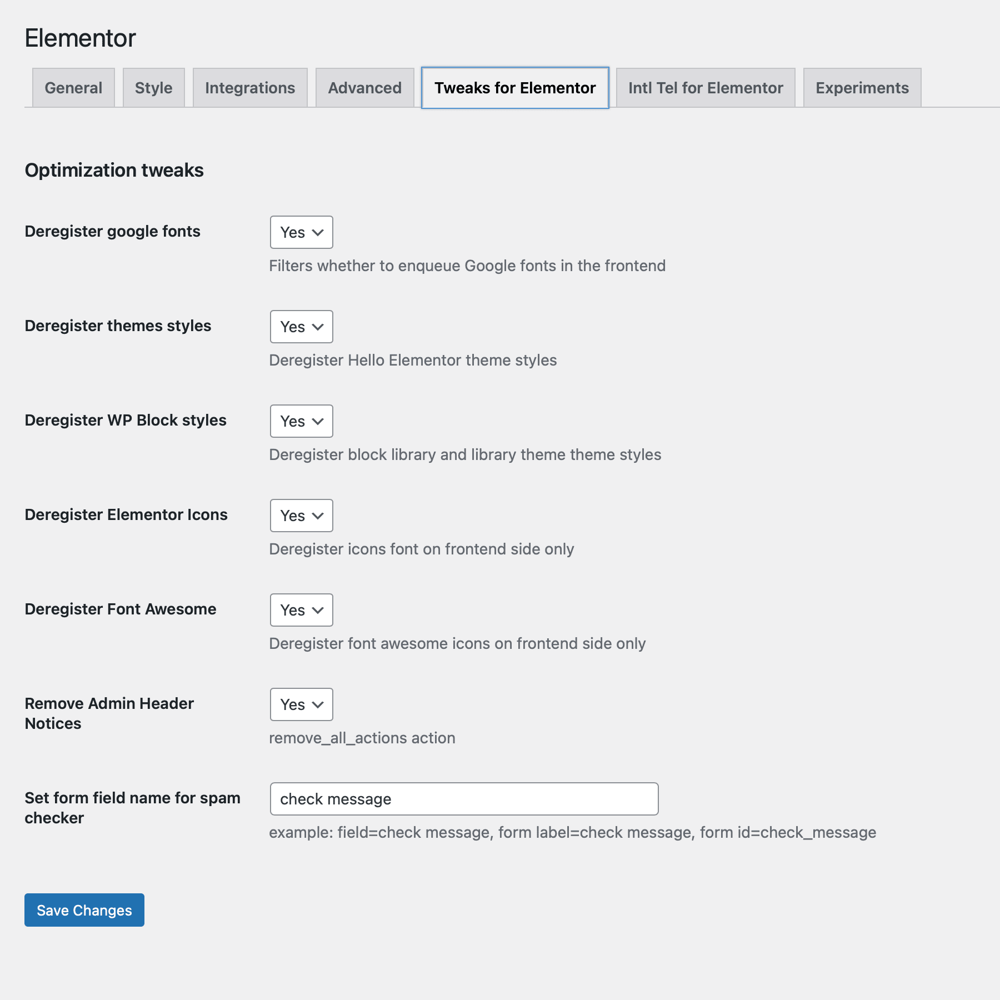

# Tweaks for Elementor
- Contributors: CDK Comp, mihdan
- Donate link: https://www.paypal.me/cdkdev
- Tags: elementor, seo, optimization, speed, design, tweaks
- Requires at least: 5.0
- Tested up to: 5.4.1
- Stable tag: 1.0.1
- Requires PHP: 5.6.20
- License: GPLv2 or later
- License URI: https://www.gnu.org/licenses/gpl-2.0.html

## Description
Tweaks for Elementor is simple plugin with few features to disable the default Fonts and CSS files of Elementor and Hello Elementor Theme

### Installation

#### Installing from the WordPress control panel

1. Go to the page "Plugins > Add New".
2. Input the name "Tweaks for Elementor" in the search field
3. Find the "Tweaks for Elementor" plugin in the search result and click on the "Install Now" button, the installation process of plugin will begin.
4. Click "Activate" when the installation is complete.

#### Installing with the archive

1. Go to the page "Plugins > Add New" on the WordPress control panel
2. Click on the "Upload Plugin" button, the form to upload the archive will be opened.
3. Select the archive with the plugin and click "Install Now".
4. Click on the "Activate Plugin" button when the installation is complete.

#### Manual installation

1. Upload the folder `tweaks-for-elementor` to a directory with the plugin, usually it is `/wp-content/plugins/`.
2. Go to the page "Plugins > Add New" on the WordPress control panel
3. Find "Tweaks for Elementor" in the plugins list and click "Activate".

### Frequently Asked Questions

#### The tweaks not working on the frontend side
- Most of tweaks based on css, so if you don't see any changes on the frontend side, try to regenerate the files via Elementor Tool

### Screenshots
1. Tweaks for Elementor Settings screen

### Changelog

##### 1.0.2 (10.10.2020)
* Tweak: added intl tel input support with geo detection based on [ipinfo.io](https://ipinfo.io/) service

##### 1.0.1 (13.05.2020)
* Fix: banner for wp.org
* Fix: readme.txt changes
* New: Manual activation link
* Tweak: Admin meta with link to GitHub repository
* Tweak: Meta to plugin settings

##### 1.0.0 (12.05.2020)
* Plugin init

* Tweak: Minor UI improvement in Slider Control
* Tweak: Added support for range handles in Slider Control
* Fix: Stretch Inner Section in the editor ([#7430](https://github.com/elementor/elementor/issues/7430))
* Fix: Ensure print order of Elementor config JS variables ([#7443](https://github.com/elementor/elementor/issues/7443))
* Fix: Inline elements not working on new pages ([#7433](https://github.com/elementor/elementor/issues/7433))
* Fix: Removed media `id` when attachment is missing

### Upgrade Notice
You should update for better plugin work
